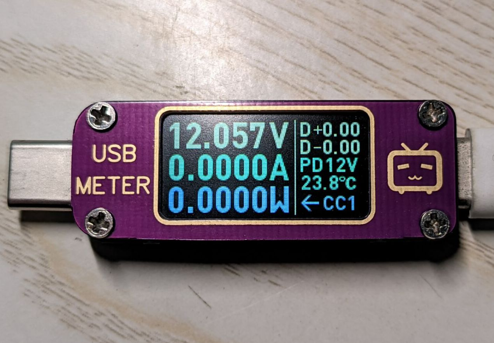
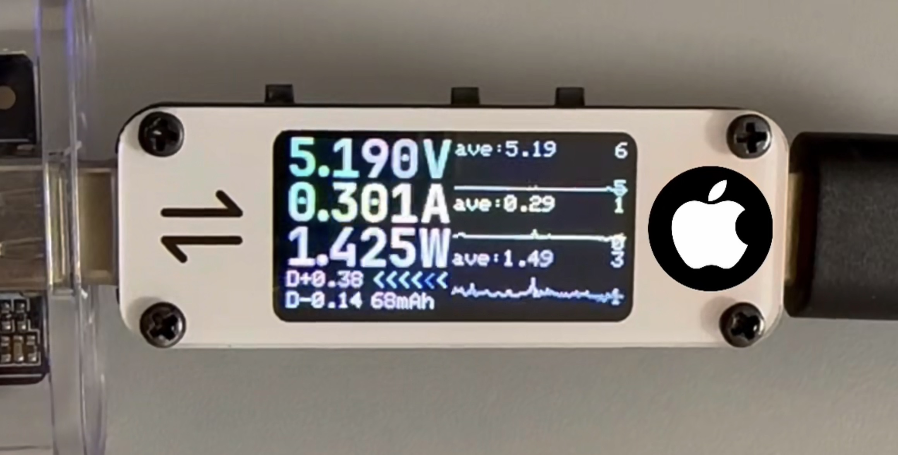
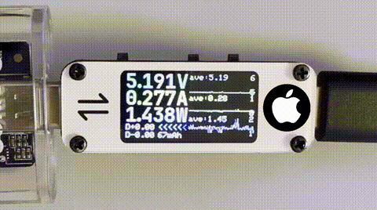
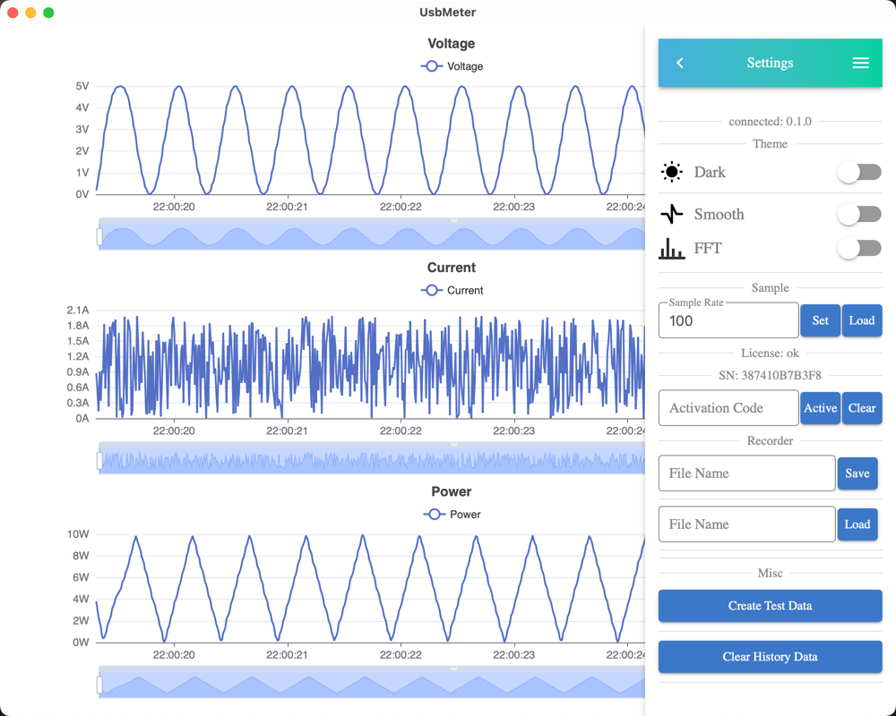

# USB_METER

此固件适用于大佬的项目：基于ESP32-PICO-D4的USB功率计

## Why

原固件功能比较丰富，作者已免注册，感谢原作者的付出。  
原项目地址：https://oshwhub.com/qaxslk/dai-PD-QCyou-pian-jian-ce-yi-ji-

但是还缺一些我想要的功能：

### 波形展示

既实用又炫酷，可以直观地感受电压电流波动。还可以展示FFT等信号分析（目前仅在上位机实现）。

### 上位机支持

上位机能够提供更多的功能和可玩性：超长时间的波形图观测、频谱分析、采集记录等。  
很多需求也是非常有意义的，比如监测一段较长时间内的充电行为等。

同时也是为了个人学习实验，目前采用Tauri的技术方案，配合Rust+Vue的技术栈。  
这是一个非常不错的框架，推荐学习：https://github.com/tauri-apps/tauri

而且这个框架还可以支持移动端：iOS和Android设备。  
注：目前仅支持PC端。

### 其他说明

* 开机20秒倒计时  
  目前有注册机制，但可以永久试用，实际也不太影响使用，算是开机广告。介意慎用。  
  喜欢的话想要激活可以联系我，感谢支持。  
  未经允许禁止商业行为。

* 不支持协议分析  
  FUSB302相关的功能未实现

* 硬件差异
  当前固件适用于一代表，基于ESP32-PICO-D4。硬件也许有细微差异，有问题可联系修复。

## Preview

#### 原固件

#### 新固件

注：拍摄效果不太好，实际会更好看一些。有任何建议欢迎提[issues](https://github.com/shuai132/USB_METER/issues)。

#### 上位机

注：目前还有一些小问题，很快会上传。

## Future

### 表

* [x] 电压、电流、功率展示
* [x] 波形展示、自适应Y轴
* [x] 屏幕方向设置
* [x] 电流方向显示
* [x] 各平均值显示
* [x] USB D+ D- 电压
* [x] 软件库仑计容量计算
* [ ] 上位机OTA
* [ ] 分页展示

### 上位机

* [x] 电压、电流、功率曲线
* [x] FFT频谱
* [x] 自动连接
* [ ] macOS安装包
* [ ] Windows安装包
* [ ] Linux安装包

## TODO or NOT TODO

* DIY新表想法
  我比较倾向于typec直连，做到被测电路无感知。仅Type-C正极串联采样电阻+ESP32+INA226即可。新增独立USB HID口与上位机通信会更加稳定。
  如果有感兴趣的网友愿意DIY，欢迎联系。我可以购买成品自己玩，以及适配软件。

* 充电协议分析
  我不太懂，而且目前用不到。有需要或愿意做的可以先交流讨论。

## Usage

### 按键功能

上端三个按键分别是：SET、-、+

* SET单击：切换屏幕方向
* SET双击：暂停屏幕更新
* SET三击：切换模拟数据
* SET长按：切换波形连续或散点
* +单击：亮度增加
* -单击：亮度降低
* +长按：切换显示温度或容量
* -长按：清零容量统计

### 烧录

提供bin镜像见[Release](https://github.com/shuai132/USB_METER/releases)页面，需用串口烧录。
烧录说明见原项目描述：https://oshwhub.com/qaxslk/dai-PD-QCyou-pian-jian-ce-yi-ji-

### 其他说明

* 目前采样率范围1 ~ 100次每秒，默认值100。数据通过WiFi实时传输，在网络信道不拥挤的时候已验证比较流畅。但是网络状况不佳时，请调低采样率。
